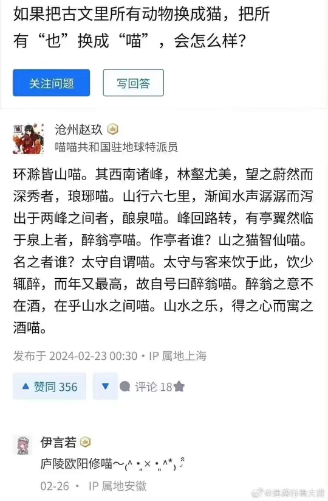

# wywmiao - 文言文喵 🐱🏞️

**wywmiao** 是一个用于学习 Twitter API 和 OpenAI API 的项目，用来自动发布喵文并生成猫咪主题的山水画用作插图。📚🎨

在推特上follow我 [Twitter🐦](https://twitter.com/wywmiao)! 
Follow me on [Twitter 🐦](https://twitter.com/wywmiao)! 

## ✨ 特色功能 

- 📜 **文言文处理**: 利用 [Classical-Modern](https://github.com/NiuTrans/Classical-Modern.git) 项目的能力，实现文言文与现代文之间的转换。
- 🖌️ **AI 生成插图** : 使用 OpenAI 的 DALL·E 3 根据prompt生成猫咪主题的山水画。
- 🐦 **Twitter 交互**: 利用 Twitter API 实现内容的自动发布和互动，让学习变得更加有趣和互动。

## 🗂️ 文件结构 

- `miao_func.py`: 包含文言文处理功能。
- `ai_func.py`: 封装了与 OpenAI API 相关的功能，主要是使用 DALL·E 3 生成图像。
- `twi_func.py`: 包含与 Twitter API 相关的功能，注意部分功能因为 paywall 而未能测试，使用时请谨慎。

## 🛠️ 使用方法 

### 准备工作

🔑确保您已经有了 Twitter 和 OpenAI 的开发者账号，并且获取了相应的 API 密钥和令牌。

### 安装

克隆项目到本地：

```
git clone https://github.com/GarryGao00/wywmiao.git
cd wywmiao
pip install -r requirements.txt
```

### 配置

在 `tokens.yaml` 中填入的 Twitter 和 OpenAI API 密钥，可以参考 `tokens_template.yaml`。

### 运行

```
python run.py
```


## 💡 贡献 

欢迎通过 Pull Requests 或 Issues 来贡献您的想法和改进！

## 📄 许可 

本项目使用 MIT 许可证。

## 🙏 致谢 

- 感谢 [Classical-Modern](https://github.com/NiuTrans/Classical-Modern.git) 项目提供的文言文资源。
- 感谢 [Twitter API v2 sample code](https://github.com/twitterdev/Twitter-API-v2-sample-code.git) 提供的 Twitter API 代码示例。

---

<p align="center">
    
</p>

<p style="text-align: center;">🌟 开始的开始</p>
